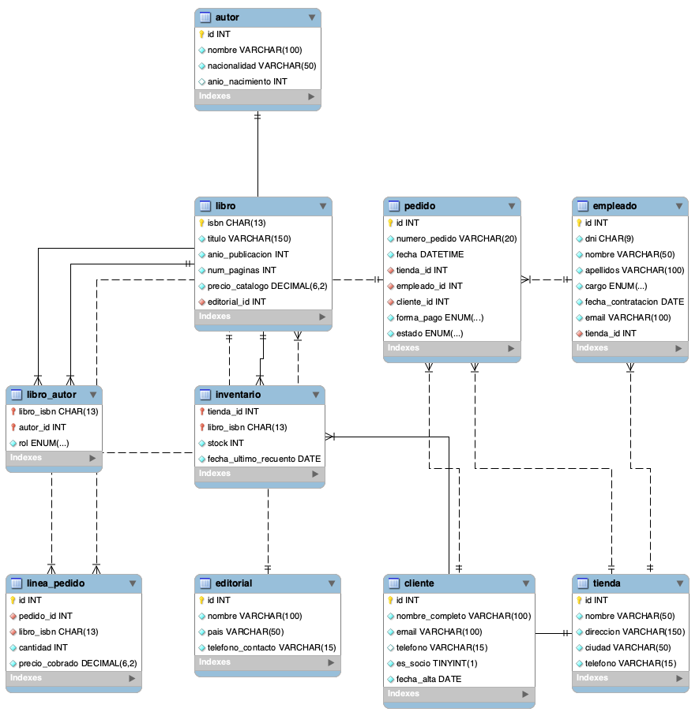

# Base de datos de Páginas de Villa Serena

---

## 1. Resumen del caso

**Páginas de Villa Serena** es una cadena de librerías de Elena Ruiz con 3 tiendas: Centro, Ribera (en Aldeaverde) y Universidad.

Actualmente llevan el control de stock, empleados y ventas con hojas de cálculo y notas en papel. Esto les causa varios problemas:

- No saben el stock real que hay en cada tienda ni cuándo se hizo el último recuento.
- En las hojas tienen autores mezclados en la misma celda y editoriales repetidas.
- Cuando cambia el precio de un libro en el catálogo, se alteran los totales de pedidos antiguos y las cuentas no cuadran.

La base de datos relacional debe solucionar esto:

1. Controlar el stock exacto por tienda y la fecha de recuento.
2. Organizar libros (por ISBN), editoriales y autores (distinguiendo autor principal o colaborador).
3. Gestionar empleados por tienda y clientes (socios y no socios).
4. Registrar los pedidos guardando el precio real cobrado de cada libro en ese momento.
5. Permitir consultas rápidas sobre ventas, facturación y disponibilidad.

---

## 2. Análisis del caso

### 2.1 Entidades y atributos

| Entidad      | Atributos                                                                        | Notas del caso                               |
| ------------ | -------------------------------------------------------------------------------- | -------------------------------------------- |
| Tienda       | id, nombre, direccion, ciudad, telefono                                          | 3 tiendas físicas (§1)                       |
| Editorial    | id, nombre, pais, telefono_contacto                                              | Una editorial por libro (§2)                 |
| Autor        | id, nombre, nacionalidad, anio_nacimiento                                        | Autores de los libros (§2)                   |
| Libro        | isbn, titulo, anio_publicacion, num_paginas, precio_catalogo, editorial_id       | Clave ISBN de 13 cifras (§2)                 |
| Empleado     | id, dni, nombre, apellidos, cargo, fecha_contratacion, email, tienda_id          | Trabaja en una sola tienda (§4)              |
| Cliente      | id, nombre_completo, email, telefono, es_socio, fecha_alta                       | Email único (§5)                             |
| Pedido       | id, numero_pedido, fecha, tienda_id, empleado_id, cliente_id, forma_pago, estado | Efectivo, tarjeta o bizum (§6)               |
| Libro_Autor  | libro_isbn, autor_id, rol                                                        | Intermedia con rol (principal o colaborador) |
| Inventario   | tienda_id, libro_isbn, stock, fecha_ultimo_recuento                              | Intermedia con stock y fecha recuento        |
| Linea_Pedido | id, pedido_id, libro_isbn, cantidad, precio_cobrado                              | Intermedia con cantidad y precio cobrado     |

### 2.2 Relaciones

| Relación          | Tipo | Cómo se resuelve   | Explicación                                           |
| ----------------- | ---- | ------------------ | ----------------------------------------------------- |
| Editorial – Libro | 1:N  | libro.editorial_id | Una editorial publica varios libros                   |
| Libro – Autor     | N:M  | Tabla libro_autor  | Libros con varios autores y autores con varios libros |
| Tienda – Libro    | N:M  | Tabla inventario   | Stock de libros por tienda                            |
| Tienda – Empleado | 1:N  | empleado.tienda_id | Cada empleado pertenece a una sola tienda             |
| Tienda – Pedido   | 1:N  | pedido.tienda_id   | Cada venta se hace en una tienda                      |
| Empleado – Pedido | 1:N  | pedido.empleado_id | Un empleado atiende varios pedidos                    |
| Cliente – Pedido  | 1:N  | pedido.cliente_id  | Un cliente hace varios pedidos                        |
| Pedido – Libro    | N:M  | Tabla linea_pedido | Un pedido incluye varios libros                       |

### 2.3 Datos descartados

| Dato                              | Motivo                                                        |
| --------------------------------- | ------------------------------------------------------------- |
| Total del ticket                  | Se calcula en la consulta sumando cantidad \* precio_cobrado  |
| Historial de tiendas del empleado | Elena indicó que solo necesita que figure en su tienda actual |
| Autores juntos en una celda       | Se separan en la tabla intermedia libro_autor                 |

---

## 3. Reglas de negocio

1. Cada tienda tiene un nombre único y su propio teléfono.
2. Cada libro se identifica por su código ISBN de 13 dígitos.
3. Un libro pertenece a una sola editorial.
4. Un libro puede tener varios autores, indicando si es autor principal o colaborador.
5. Cada empleado trabaja en una sola tienda. DNI y email son únicos.
6. Los cargos válidos son: librero, cajero y encargado.
7. El email del cliente es único.
8. El stock no puede ser negativo y registra la fecha del último recuento.
9. La línea de pedido guarda el precio cobrado en el momento de la venta.
10. Todo pedido tiene tienda, empleado y cliente asociados.
11. Pagos admitidos: efectivo, tarjeta o bizum. Estados: preparado, entregado o cancelado.

---

## 4. Diagrama entidad-relación



### Tabla de relaciones

| Relación          | Tipo | Cómo se resuelve                 |
| ----------------- | ---- | -------------------------------- |
| editorial – libro | 1:N  | Clave foránea libro.editorial_id |
| libro – autor     | N:M  | Tabla intermedia libro_autor     |
| tienda – libro    | N:M  | Tabla intermedia inventario      |
| tienda – empleado | 1:N  | Clave foránea empleado.tienda_id |
| tienda – pedido   | 1:N  | Clave foránea pedido.tienda_id   |
| empleado – pedido | 1:N  | Clave foránea pedido.empleado_id |
| cliente – pedido  | 1:N  | Clave foránea pedido.cliente_id  |
| pedido – libro    | N:M  | Tabla intermedia linea_pedido    |

---

## 5. Modelo lógico

- **tienda** (id [PK], nombre [UQ], direccion, ciudad, telefono)
- **editorial** (id [PK], nombre [UQ], pais, telefono_contacto)
- **autor** (id [PK], nombre, nacionalidad, anio_nacimiento)
- **libro** (isbn [PK], titulo, anio_publicacion, num_paginas, precio_catalogo, editorial_id [FK -> editorial.id])
- **empleado** (id [PK], dni [UQ], nombre, apellidos, cargo, fecha_contratacion, email [UQ], tienda_id [FK -> tienda.id])
- **cliente** (id [PK], nombre_completo, email [UQ], telefono, es_socio, fecha_alta)
- **libro_autor** (libro_isbn [PK, FK -> libro.isbn], autor_id [PK, FK -> autor.id], rol)
- **inventario** (tienda_id [PK, FK -> tienda.id], libro_isbn [PK, FK -> libro.isbn], stock, fecha_ultimo_recuento)
- **pedido** (id [PK], numero_pedido [UQ], fecha, tienda_id [FK -> tienda.id], empleado_id [FK -> empleado.id], cliente_id [FK -> cliente.id], forma_pago, estado)
- **linea_pedido** (id [PK], pedido_id [FK -> pedido.id], libro_isbn [FK -> libro.isbn], cantidad, precio_cobrado)

---
# 6. Script SQL (schema.sql)

El código ejecutable completo está en el archivo [`schema.sql`](schema.sql).

```sql
CREATE DATABASE IF NOT EXISTS libreria_serena;
USE libreria_serena;

CREATE TABLE tienda (
    id INT AUTO_INCREMENT PRIMARY KEY,
    nombre VARCHAR(50) NOT NULL UNIQUE,
    direccion VARCHAR(150) NOT NULL,
    ciudad VARCHAR(50) NOT NULL,
    telefono VARCHAR(15) NOT NULL
);

CREATE TABLE editorial (
    id INT AUTO_INCREMENT PRIMARY KEY,
    nombre VARCHAR(100) NOT NULL UNIQUE,
    pais VARCHAR(50) NOT NULL,
    telefono_contacto VARCHAR(15) NOT NULL
);

CREATE TABLE autor (
    id INT AUTO_INCREMENT PRIMARY KEY,
    nombre VARCHAR(100) NOT NULL,
    nacionalidad VARCHAR(50) NOT NULL,
    anio_nacimiento INT
);

CREATE TABLE cliente (
    id INT AUTO_INCREMENT PRIMARY KEY,
    nombre_completo VARCHAR(100) NOT NULL,
    email VARCHAR(100) NOT NULL UNIQUE,
    telefono VARCHAR(15),
    es_socio BOOLEAN NOT NULL DEFAULT FALSE,
    fecha_alta DATE NOT NULL
);

CREATE TABLE libro (
    isbn CHAR(13) PRIMARY KEY,
    titulo VARCHAR(150) NOT NULL,
    anio_publicacion INT NOT NULL,
    num_paginas INT NOT NULL CHECK (num_paginas > 0),
    precio_catalogo DECIMAL(6, 2) NOT NULL CHECK (precio_catalogo >= 0),
    editorial_id INT NOT NULL,
    FOREIGN KEY (editorial_id) REFERENCES editorial(id)
);

CREATE TABLE empleado (
    id INT AUTO_INCREMENT PRIMARY KEY,
    dni CHAR(9) NOT NULL UNIQUE,
    nombre VARCHAR(50) NOT NULL,
    apellidos VARCHAR(100) NOT NULL,
    cargo ENUM('librero', 'cajero', 'encargado') NOT NULL,
    fecha_contratacion DATE NOT NULL,
    email VARCHAR(100) NOT NULL UNIQUE,
    tienda_id INT NOT NULL,
    FOREIGN KEY (tienda_id) REFERENCES tienda(id)
);

CREATE TABLE libro_autor (
    libro_isbn CHAR(13) NOT NULL,
    autor_id INT NOT NULL,
    rol ENUM('principal', 'colaborador') NOT NULL DEFAULT 'principal',
    PRIMARY KEY (libro_isbn, autor_id),
    FOREIGN KEY (libro_isbn) REFERENCES libro(isbn) ON DELETE CASCADE,
    FOREIGN KEY (autor_id) REFERENCES autor(id) ON DELETE CASCADE
);

CREATE TABLE inventario (
    tienda_id INT NOT NULL,
    libro_isbn CHAR(13) NOT NULL,
    stock INT NOT NULL DEFAULT 0 CHECK (stock >= 0),
    fecha_ultimo_recuento DATE NOT NULL,
    PRIMARY KEY (tienda_id, libro_isbn),
    FOREIGN KEY (tienda_id) REFERENCES tienda(id) ON DELETE CASCADE,
    FOREIGN KEY (libro_isbn) REFERENCES libro(isbn) ON DELETE CASCADE
);

CREATE TABLE pedido (
    id INT AUTO_INCREMENT PRIMARY KEY,
    numero_pedido VARCHAR(20) NOT NULL UNIQUE,
    fecha DATETIME NOT NULL,
    tienda_id INT NOT NULL,
    empleado_id INT NOT NULL,
    cliente_id INT NOT NULL,
    forma_pago ENUM('efectivo', 'tarjeta', 'bizum') NOT NULL,
    estado ENUM('preparado', 'entregado', 'cancelado') NOT NULL DEFAULT 'preparado',
    FOREIGN KEY (tienda_id) REFERENCES tienda(id),
    FOREIGN KEY (empleado_id) REFERENCES empleado(id),
    FOREIGN KEY (cliente_id) REFERENCES cliente(id)
);

CREATE TABLE linea_pedido (
    id INT AUTO_INCREMENT PRIMARY KEY,
    pedido_id INT NOT NULL,
    libro_isbn CHAR(13) NOT NULL,
    cantidad INT NOT NULL CHECK (cantidad > 0),
    precio_cobrado DECIMAL(6, 2) NOT NULL CHECK (precio_cobrado >= 0),
    FOREIGN KEY (pedido_id) REFERENCES pedido(id) ON DELETE CASCADE,
    FOREIGN KEY (libro_isbn) REFERENCES libro(isbn)
);
```

---

## 7. Diccionario de datos

### tienda
| Columna | Tipo | Nulo | Descripción |
| --- | --- | --- | --- |
| id | INT | No (PK) | Clave primaria autoincremental |
| nombre | VARCHAR(50) | No (UQ) | Nombre de la sede (Centro, Ribera, Universidad) |
| direccion | VARCHAR(150) | No | Dirección de la tienda |
| ciudad | VARCHAR(50) | No | Ciudad donde está ubicada |
| telefono | VARCHAR(15) | No | Teléfono de contacto |

### editorial
| Columna | Tipo | Nulo | Descripción |
| --- | --- | --- | --- |
| id | INT | No (PK) | Clave primaria autoincremental |
| nombre | VARCHAR(100) | No (UQ) | Nombre de la editorial |
| pais | VARCHAR(50) | No | País de origen |
| telefono_contacto | VARCHAR(15) | No | Teléfono para pedidos |

### autor
| Columna | Tipo | Nulo | Descripción |
| --- | --- | --- | --- |
| id | INT | No (PK) | Clave primaria autoincremental |
| nombre | VARCHAR(100) | No | Nombre completo del autor |
| nacionalidad | VARCHAR(50) | No | Nacionalidad del autor |
| anio_nacimiento | INT | Sí | Año de nacimiento |

### libro
| Columna | Tipo | Nulo | Descripción |
| --- | --- | --- | --- |
| isbn | CHAR(13) | No (PK) | Código ISBN del libro |
| titulo | VARCHAR(150) | No | Título de la obra |
| anio_publicacion | INT | No | Año en que se publicó |
| num_paginas | INT | No | Número de páginas |
| precio_catalogo | DECIMAL(6,2) | No | Precio oficial de catálogo |
| editorial_id | INT | No (FK) | Clave foránea de la editorial |

### libro_autor
| Columna | Tipo | Nulo | Descripción |
| --- | --- | --- | --- |
| libro_isbn | CHAR(13) | No (PK, FK) | Clave foránea del libro |
| autor_id | INT | No (PK, FK) | Clave foránea del autor |
| rol | ENUM | No | Rol: 'principal' o 'colaborador' |

### empleado
| Columna | Tipo | Nulo | Descripción |
| --- | --- | --- | --- |
| id | INT | No (PK) | Clave primaria autoincremental |
| dni | CHAR(9) | No (UQ) | DNI del empleado |
| nombre | VARCHAR(50) | No | Nombre |
| apellidos | VARCHAR(100) | No | Apellidos |
| cargo | ENUM | No | 'librero', 'cajero' o 'encargado' |
| fecha_contratacion | DATE | No | Fecha de contratación |
| email | VARCHAR(100) | No (UQ) | Correo de trabajo |
| tienda_id | INT | No (FK) | Tienda donde trabaja |

### cliente
| Columna | Tipo | Nulo | Descripción |
| --- | --- | --- | --- |
| id | INT | No (PK) | Clave primaria autoincremental |
| nombre_completo | VARCHAR(100) | No | Nombre y apellidos del cliente |
| email | VARCHAR(100) | No (UQ) | Correo de contacto |
| telefono | VARCHAR(15) | Sí | Teléfono opcional |
| es_socio | BOOLEAN | No | TRUE si es socio con descuento |
| fecha_alta | DATE | No | Fecha de registro |

### inventario
| Columna | Tipo | Nulo | Descripción |
| --- | --- | --- | --- |
| tienda_id | INT | No (PK, FK) | Tienda donde está el stock |
| libro_isbn | CHAR(13) | No (PK, FK) | Libro inventariado |
| stock | INT | No | Copias disponibles (mínimo 0) |
| fecha_ultimo_recuento | DATE | No | Fecha del último recuento físico |

### pedido
| Columna | Tipo | Nulo | Descripción |
| --- | --- | --- | --- |
| id | INT | No (PK) | Clave primaria autoincremental |
| numero_pedido | VARCHAR(20) | No (UQ) | Número de ticket |
| fecha | DATETIME | No | Fecha y hora de compra |
| tienda_id | INT | No (FK) | Tienda donde se hizo |
| empleado_id | INT | No (FK) | Empleado que atendió |
| cliente_id | INT | No (FK) | Cliente que compró |
| forma_pago | ENUM | No | 'efectivo', 'tarjeta' o 'bizum' |
| estado | ENUM | No | 'preparado', 'entregado' o 'cancelado' |

### linea_pedido
| Columna | Tipo | Nulo | Descripción |
| --- | --- | --- | --- |
| id | INT | No (PK) | Clave primaria autoincremental |
| pedido_id | INT | No (FK) | Pedido al que pertenece |
| libro_isbn | CHAR(13) | No (FK) | Libro comprado |
| cantidad | INT | No | Cantidad de unidades |
| precio_cobrado | DECIMAL(6,2) | No | Precio cobrado por unidad |

---

## 8. Decisiones de diseño

### Decisión 1: Guardar el precio cobrado en linea_pedido
- **Qué se decidió:** Poner la columna `precio_cobrado` en cada línea del pedido.
- **Por qué:** Los precios de catálogo cambian con el tiempo. Si se consultara el precio de la tabla `libro`, los pedidos antiguos cambiarían su total y las facturas viejas no cuadrarían.
- **Alternativa descartada:** Consultar siempre `libro.precio_catalogo`.

### Decisión 2: Tabla intermedia libro_autor con rol
- **Qué se decidió:** Crear una tabla N:M entre `libro` y `autor` con la columna `rol`.
- **Por qué:** Hay libros con varios autores y autores con varios libros. También hace falta saber si un autor es principal o colaborador (como el prologuista).
- **Alternativa descartada:** Escribir los autores juntos en un solo campo de texto como estaba en la hoja de cálculo.

### Decisión 3: Tabla intermedia inventario con fecha de recuento
- **Qué se decidió:** Crear la tabla `inventario` con `stock` y `fecha_ultimo_recuento`.
- **Por qué:** Cada tienda tiene su propio stock y necesitan saber cuándo se contó por última vez para no buscar libros donde no hay.
- **Alternativa descartada:** Una sola columna de stock en la tabla `libro` o columnas por tienda (`stock_centro`, `stock_ribera`).

### Decisión 4: Uso de DECIMAL(6,2) para precios
- **Qué se decidió:** Usar `DECIMAL(6,2)` para los precios.
- **Por qué:** Tipos como `FLOAT` o `DOUBLE` pueden dar fallos de redondeo en operaciones con céntimos.
- **Alternativa descartada:** Usar `FLOAT`.

---

## 9. Datos de prueba

Para comprobar que la base de datos funciona, se han cargado datos de ejemplo coherentes con el caso:
- **3 tiendas:** Centro, Ribera y Universidad.
- **4 editoriales:** Alfaguara, Alianza, Plaza & Janés y FCE.
- **5 autores:** Julio Cortázar, Jorge Luis Borges, Isabel Allende, Juan Rulfo y Gabriel García Márquez.
- **6 libros:** Rayuela, Ficciones, Cuentos de Eva Luna, Antología del cuento (con dos autores), Pedro Páramo y Cien años de soledad.
- **4 empleados:** Cajera, encargado y libreros en sus tiendas.
- **4 clientes:** Socios y clientes sin registrar.
- **Inventario:** Con stocks por tienda y el caso del libro agotado en Centro pero disponible en Universidad.
- **5 pedidos:** Con el ticket real nº 10482 de Elena.

---

## 10. Consultas de prueba

### 1. ¿Qué libros tiene la tienda Centro y cuántas copias quedan?
```sql
SELECT l.titulo, l.isbn, i.stock, i.fecha_ultimo_recuento
FROM inventario i
JOIN libro l ON l.isbn = i.libro_isbn
JOIN tienda t ON t.id = i.tienda_id
WHERE t.nombre = 'Centro' AND i.stock > 0;
```

| titulo | isbn | stock | fecha_ultimo_recuento |
| --- | --- | --- | --- |
| Rayuela | 9788420412146 | 5 | 2026-03-01 |
| Ficciones | 9788420658872 | 3 | 2026-03-01 |
| Pedro Páramo | 9788437604947 | 2 | 2026-03-01 |

---

### 2. ¿Cuál es el libro más vendido en cada tienda?
```sql
SELECT t.nombre AS tienda, l.titulo, SUM(lp.cantidad) AS total_vendido
FROM linea_pedido lp
JOIN pedido p ON p.id = lp.pedido_id
JOIN tienda t ON t.id = p.tienda_id
JOIN libro l ON l.isbn = lp.libro_isbn
WHERE p.estado = 'entregado'
GROUP BY t.id, t.nombre, l.isbn, l.titulo
HAVING total_vendido = (
    SELECT MAX(sub.suma)
    FROM (
        SELECT p2.tienda_id, lp2.libro_isbn, SUM(lp2.cantidad) AS suma
        FROM linea_pedido lp2
        JOIN pedido p2 ON p2.id = lp2.pedido_id
        WHERE p2.estado = 'entregado' AND p2.tienda_id = t.id
        GROUP BY p2.tienda_id, lp2.libro_isbn
    ) sub
);
```

| tienda | titulo | total_vendido |
| --- | --- | --- |
| Centro | Ficciones | 3 |
| Ribera | Antología del cuento | 1 |
| Universidad | Rayuela | 2 |

---

### 3. ¿Cuánto ha facturado cada tienda este año?
```sql
SELECT t.nombre AS tienda, SUM(lp.cantidad * lp.precio_cobrado) AS facturacion_total
FROM pedido p
JOIN tienda t ON t.id = p.tienda_id
JOIN linea_pedido lp ON lp.pedido_id = p.id
WHERE p.estado = 'entregado' AND YEAR(p.fecha) = 2026
GROUP BY t.id, t.nombre;
```

| tienda | facturacion_total |
| --- | --- |
| Centro | 77.40 |
| Ribera | 18.00 |
| Universidad | 48.00 |

---

### 4. ¿Qué clientes han hecho más de dos pedidos?
```sql
SELECT c.nombre_completo, c.email, COUNT(p.id) AS total_pedidos
FROM cliente c
JOIN pedido p ON p.cliente_id = c.id
GROUP BY c.id, c.nombre_completo, c.email
HAVING total_pedidos > 2;
```

| nombre_completo | email | total_pedidos |
| --- | --- | --- |
| Andrés Pérez | andres.p@correo.es | 3 |

---

### 5. ¿Qué libros están agotados en una tienda pero disponibles en otra?
```sql
SELECT l.titulo, 
       t_agotada.nombre AS tienda_sin_stock, 
       t_disponible.nombre AS tienda_con_stock, 
       i_disp.stock AS copias_disponibles
FROM inventario i_agot
JOIN tienda t_agotada ON t_agotada.id = i_agot.tienda_id
JOIN inventario i_disp ON i_disp.libro_isbn = i_agot.libro_isbn
JOIN tienda t_disponible ON t_disponible.id = i_disp.tienda_id
JOIN libro l ON l.isbn = i_agot.libro_isbn
WHERE i_agot.stock = 0 AND i_disp.stock > 0;
```

| titulo | tienda_sin_stock | tienda_con_stock | copias_disponibles |
| --- | --- | --- | --- |
| Cien años de soledad | Centro | Universidad | 3 |
| Cuentos de Eva Luna | Universidad | Ribera | 4 |

---

### 6. ¿Qué empleado ha atendido más pedidos?
```sql
SELECT e.nombre, e.apellidos, e.cargo, t.nombre AS tienda, COUNT(p.id) AS pedidos_atendidos
FROM empleado e
JOIN tienda t ON t.id = e.tienda_id
LEFT JOIN pedido p ON p.empleado_id = e.id
GROUP BY e.id, e.nombre, e.apellidos, e.cargo, t.nombre
ORDER BY pedidos_atendidos DESC
LIMIT 1;
```

| nombre | apellidos | cargo | tienda | pedidos_atendidos |
| --- | --- | --- | --- | --- |
| Marta | López Gómez | cajera | Centro | 2 |

---

### 7. ¿Qué autores tienen libros en más de una editorial?
```sql
SELECT a.nombre AS autor, COUNT(DISTINCT l.editorial_id) AS num_editoriales
FROM autor a
JOIN libro_autor la ON la.autor_id = a.id
JOIN libro l ON l.isbn = la.libro_isbn
GROUP BY a.id, a.nombre
HAVING num_editoriales > 1;
```

| autor | num_editoriales |
| --- | --- |
| Julio Cortázar | 2 |

---

## 11. Limitaciones y mejoras futuras

1. **Devoluciones:** El sistema registra pedidos entregados o cancelados, pero no devoluciones parciales de libros.
2. **Historial de precios de catálogo:** Se guarda el precio cobrado en cada venta, pero no la fecha exacta en la que cambió el precio oficial de catálogo.
3. **Alertas de stock mínimo:** Añadir una columna de stock mínimo en inventario para avisar cuando queden pocas unidades.
4. **Descuentos:** Modelar una tabla de promociones o cupones para registrar descuentos específicos de campañas.